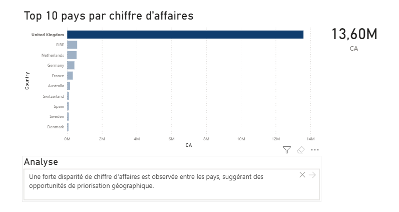
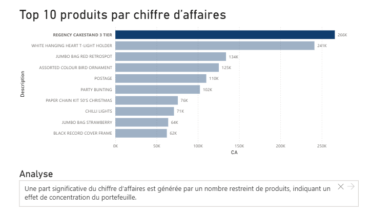
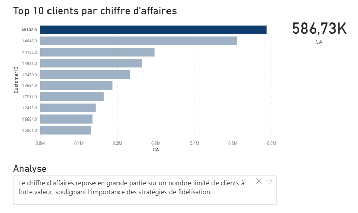
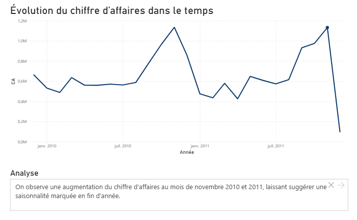

# Portfolio SQL & Power BI - Analyse des ventes e-commerce

Analyse des ventes avec SQL et Power BI : nettoyage des données, jointures, KPI et tableaux de bord décisionnels à partir d’un dataset e-commerce réel.

---

## 1. Contexte

Ce projet a pour objectif d’analyser les ventes d’une entreprise de e-commerce afin de fournir des indicateurs clés permettant d’éclairer la prise de décision business (performance commerciale, répartition géographique, produits les plus rentables).

Le projet s’inscrit dans une démarche de bout en bout :
- exploration et nettoyage des données,
- modélisation analytique,
- création de KPI,
- restitution via des tableaux de bord Power BI.

---

## 2. Problématique

**Comment identifier les principaux leviers de performance commerciale à partir des données de ventes et de clients ?**

---

## 3. Données utilisées

Le projet s’appuie sur le dataset **Online Retail (UCI)**.

Les données contiennent :
- des informations sur les **ventes** (quantité, prix unitaire, date, produit, client),
- des informations sur les **clients** (identifiant, pays).

> **Note de modélisation**  
> Les informations produit (StockCode, Description) sont conservées dans la table des ventes.  
> Le dataset ne garantissant pas l’unicité des produits, une table Produits dédiée n’a pas été conservée afin d’assurer un modèle Power BI cohérent et exploitable.

---

## 4. Méthodologie

- Nettoyage et transformation des données (SQL et Power Query)
- Création des relations entre les tables ventes et clients
- Calcul des indicateurs métier (chiffre d’affaires, agrégations)
- Construction de tableaux de bord décisionnels dans Power BI
- Validation de la cohérence des résultats via plusieurs visuels

---

## 5. Traitements SQL

Les traitements SQL incluent notamment :
- calcul du chiffre d’affaires,
- jointures entre ventes et clients,
- analyses par client, pays et produit,
- identification des entités les plus performantes.

📁 Les requêtes SQL sont disponibles dans le dossier `/queries`.

---

## 6. Modélisation Power BI

- Table de faits : `sales`
- Table de dimension : `customers`
- Relation :  
  `customers[CustomerID] (1)` → `sales[CustomerID] (*)`
- Création de mesures DAX pour les indicateurs clés

---

## 7. Questions métier & visualisations

### Question métier 1 — Quel pays génère le plus de chiffre d’affaires ?

**KPI**
- Chiffre d’affaires = `SUMX(sales, Quantity * UnitPrice)`

**Visuel**
- Carte KPI : Chiffre d’affaires total
- Graphique en barres : Top 10 pays par chiffre d’affaires
 

**Analyse**
> Cette analyse permet d’identifier les marchés les plus rentables et de prioriser les efforts commerciaux par zone géographique.

---

### Question métier 2 — Quels produits génèrent le plus de chiffre d’affaires ?

**KPI**
- Chiffre d’affaires (même mesure)

**Visuel**
- Graphique en barres : Top 10 produits par chiffre d’affaires
- Infobulle (tooltip) : StockCode pour une identification précise

**Analyse**
> Cette analyse met en évidence les produits les plus contributeurs au chiffre d’affaires et peut guider les décisions liées au catalogue et aux actions marketing.

## Question métier 3 — Quels clients génèrent le plus de chiffre d’affaires ?

### Objectif business
Identifier les clients à forte valeur afin de mieux comprendre la concentration du chiffre d’affaires et les opportunités de fidélisation.

### Indicateurs clés
- **Chiffre d’affaires** : somme de `Quantity × UnitPrice`
- **CustomerID**
- **Pays** (information complémentaire)

### Visualisation Power BI
- Graphique en barres – **Top 10 clients par chiffre d’affaires**
- Exclusion des clients non identifiés (`CustomerID` vide)

### Analyse
Le chiffre d’affaires est fortement concentré sur un nombre limité de clients à forte valeur.  
Cette dépendance à certains clients clés représente à la fois une opportunité de fidélisation et un risque potentiel en cas de perte de ces clients.

---

## Question métier 4 — Comment évolue le chiffre d’affaires dans le temps ?

### Objectif business
Analyser l’évolution du chiffre d’affaires afin d’identifier des tendances globales et d’éventuels effets de saisonnalité.

### Indicateurs clés
- **Chiffre d’affaires**
- **Date de commande** (agrégée par mois et par année)

### Visualisation Power BI
- Graphique en courbe – **Évolution mensuelle du chiffre d’affaires**
- Axe temporel basé sur la hiérarchie de dates (année / mois)

### Analyse
L’analyse met en évidence des pics récurrents de chiffre d’affaires au mois de novembre sur plusieurs années, suggérant une saisonnalité marquée en fin d’année.  
Ces variations peuvent être prises en compte dans la planification commerciale et les actions marketing.

---

### Note méthodologique
Les analyses sont basées sur les données disponibles dans le dataset *Online Retail (UCI)*.  
Certaines variations observées peuvent être influencées par la couverture temporelle incomplète de certaines périodes.

---

## 8. Résultats clés

- Forte concentration du chiffre d’affaires sur un nombre limité de pays
- Identification claire des produits les plus rentables
- Données exploitables pour orienter une stratégie commerciale et géographique

---

## 9. Recommandations business

- Prioriser les marchés générant le plus de chiffre d’affaires
- Mettre en avant les produits les plus performants
- Ajuster la stratégie commerciale selon la répartition géographique des ventes

---

## 10. Outils utilisés

- SQL
- Power BI
- Power Query
- DAX
- Git / GitHub
